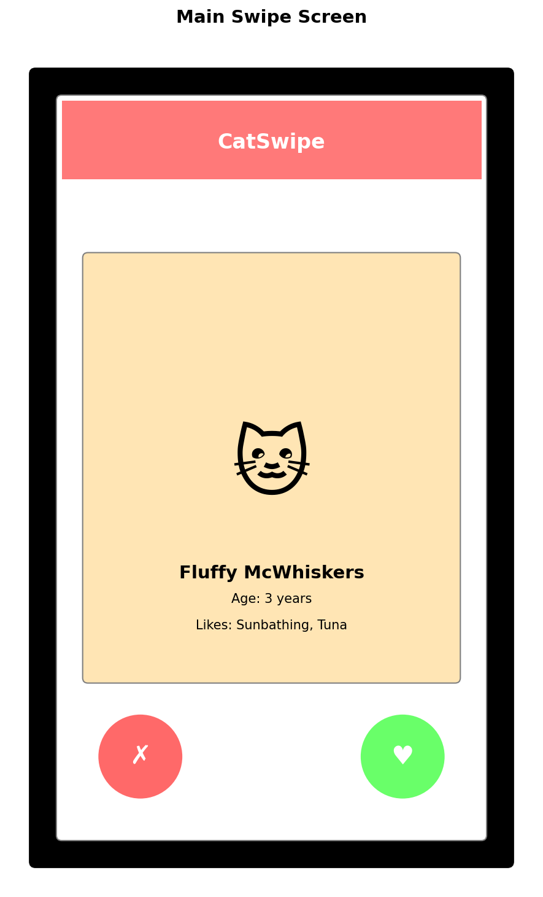
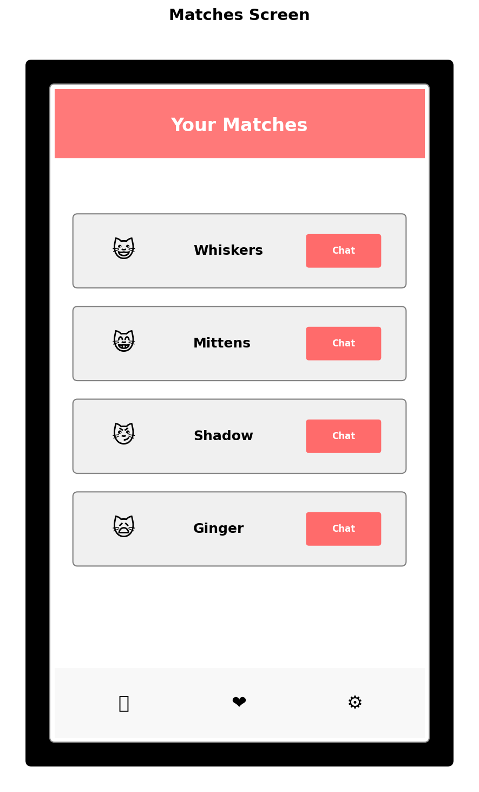

# 🐱 CatSwipe - Vibe Some MAUI Bro

**A .NET MAUI app that's like Tinder, but for discovering and collecting adorable cat photos from around the internet!**

## 🎯 What is CatSwipe?

CatSwipe is a fun, engaging mobile application that brings the addictive swiping mechanics of dating apps to the wonderful world of cat photography. Instead of matching with people, you're matching with the most adorable, funny, and heartwarming cat photos from across the web.

## ✨ Key Features

### 🔄 Swipe to Discover
- **Swipe Right (❤️)**: Save cats you love to your personal collection
- **Swipe Left (❌)**: Pass on cats that don't spark joy
- **Double Tap**: Super-like for those extra special felines

### 📸 Curated Cat Content
- High-quality cat photos from various online sources
- Different categories: Kittens, Senior cats, Funny cats, Artistic shots
- Daily fresh content with new cats added regularly

### 💝 Personal Collection
- Build your personal gallery of favorite cats
- Organize cats into custom collections (e.g., "Orange Cats", "Sleepy Cats", "Cats with Hats")
- Share your favorite finds with friends

### 🎮 Gamification Elements
- **Streak Counter**: Keep your daily cat-swiping streak alive
- **Cat Collector Badges**: Unlock achievements for different milestones
- **Daily Challenges**: "Find 5 tabby cats today" or "Discover a rare breed"

### 🤝 Social Features
- See what cats your friends are loving
- Send cats directly to friends
- Create shared collections with other cat enthusiasts
- Comment and rate cats

## 📱 App Screenshots

### Main Swipe Screen
The heart of the app where you discover new cat friends:

### Your Matches
View and organize all the cats you've fallen in love with:

## 🎨 App Concept & User Experience

### Target Audience
- Cat lovers of all ages
- People who enjoy casual mobile games
- Social media users who love sharing cute content
- Anyone looking for a fun, stress-relieving app

### Core User Journey
1. **Onboard**: Quick tutorial on swiping mechanics
2. **Discover**: Start swiping through curated cat photos
3. **Collect**: Build a personalized gallery of favorites
4. **Share**: Send favorite cats to friends or social media
5. **Return**: Daily engagement through streaks and new content

### Why It's Engaging
- **Instant Gratification**: Quick, satisfying interactions
- **Endless Content**: Always new cats to discover
- **Personal Connection**: Building your own cat collection
- **Social Aspect**: Sharing and comparing with friends
- **Stress Relief**: Pure, wholesome content that makes people smile

## 🛠️ Technical Stack
- **.NET MAUI**: Cross-platform mobile development
- **C#**: Primary programming language
- **XAML**: UI markup
- **SQLite**: Local data storage for user collections
- **HTTP Client**: Fetching cat images from APIs
- **Image Caching**: Smooth scrolling and offline capability

## 🚀 Future Features
- **Cat Breed Information**: Learn about different breeds you encounter
- **AR Camera Filter**: Take photos of real cats with fun overlays
- **Cat Adoption Integration**: Connect with local shelters
- **Premium Features**: Unlimited swipes, exclusive rare cat photos
- **Widget Support**: Daily cat on your home screen

---

*Because everyone deserves more cats in their life! 🐾*
